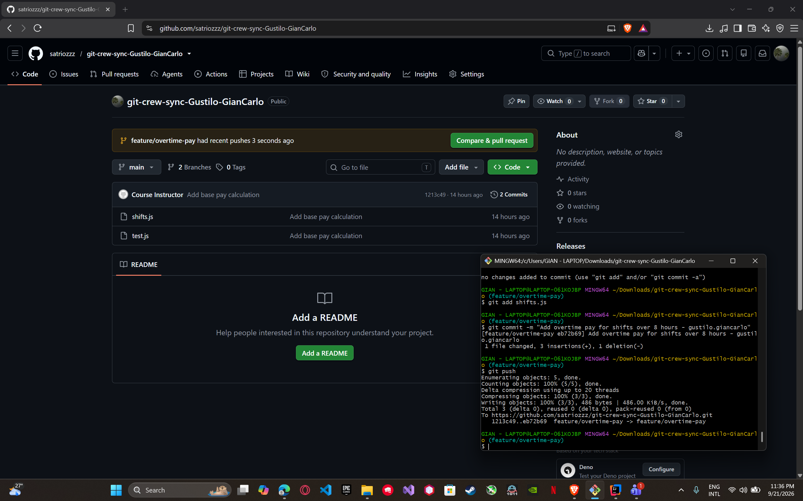
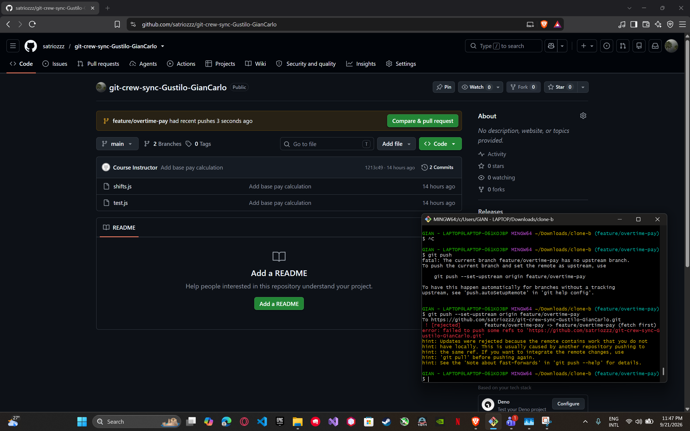
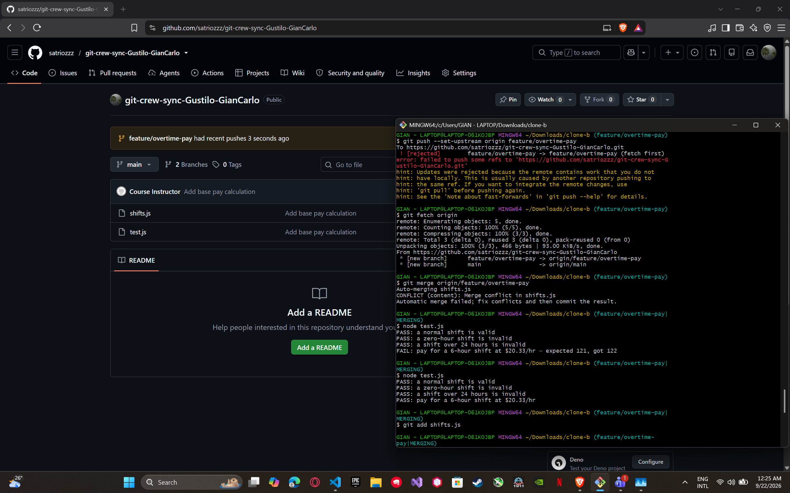
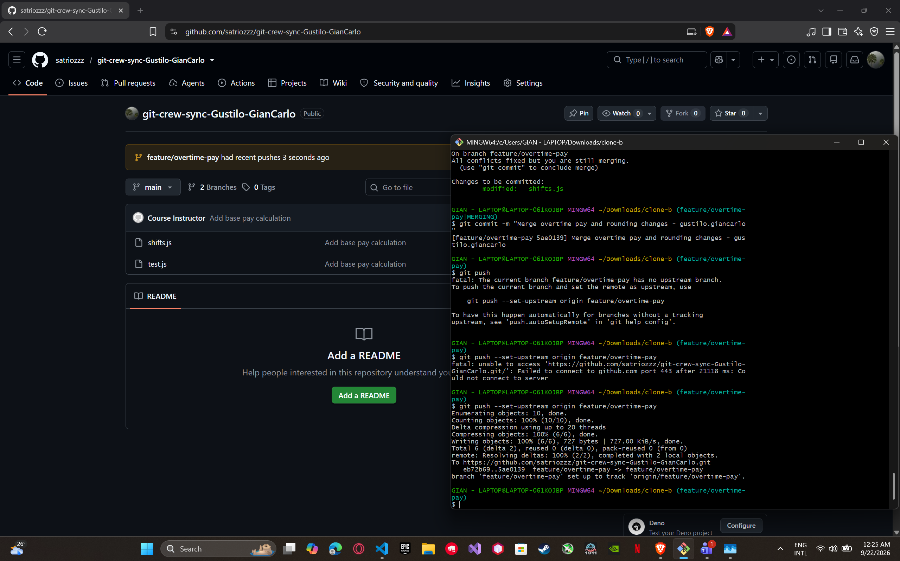
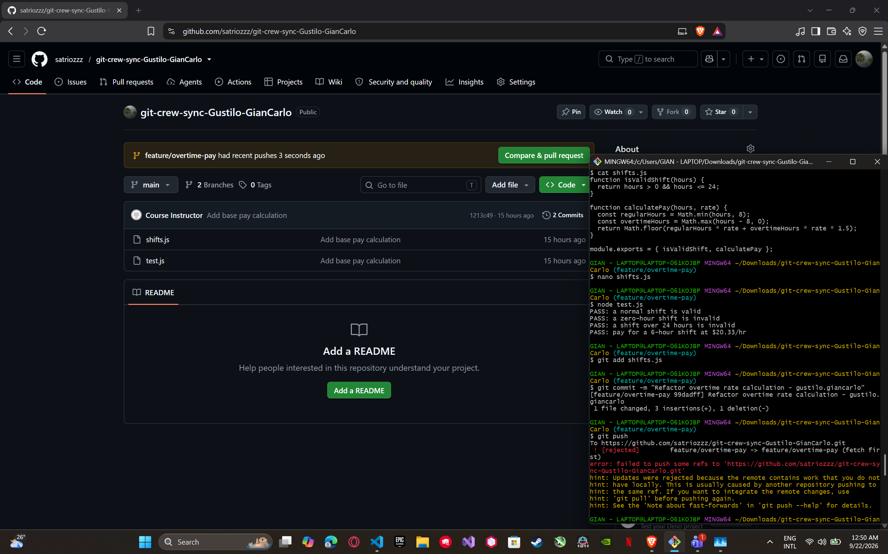
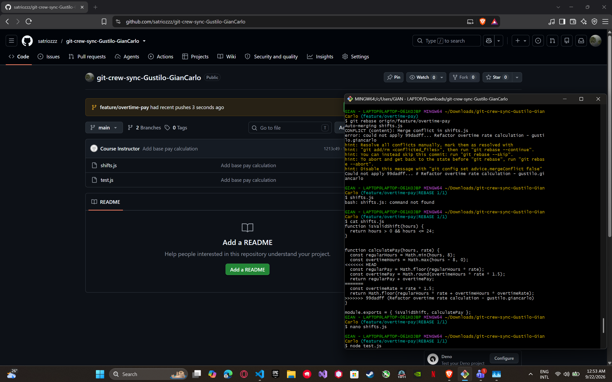
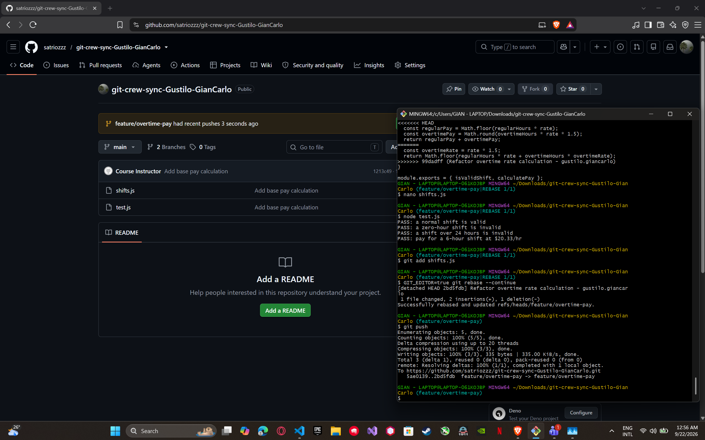
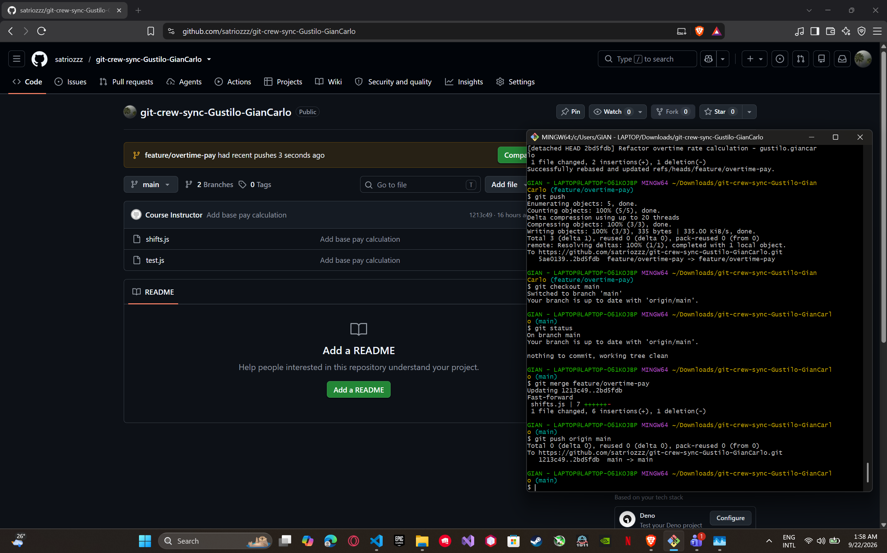
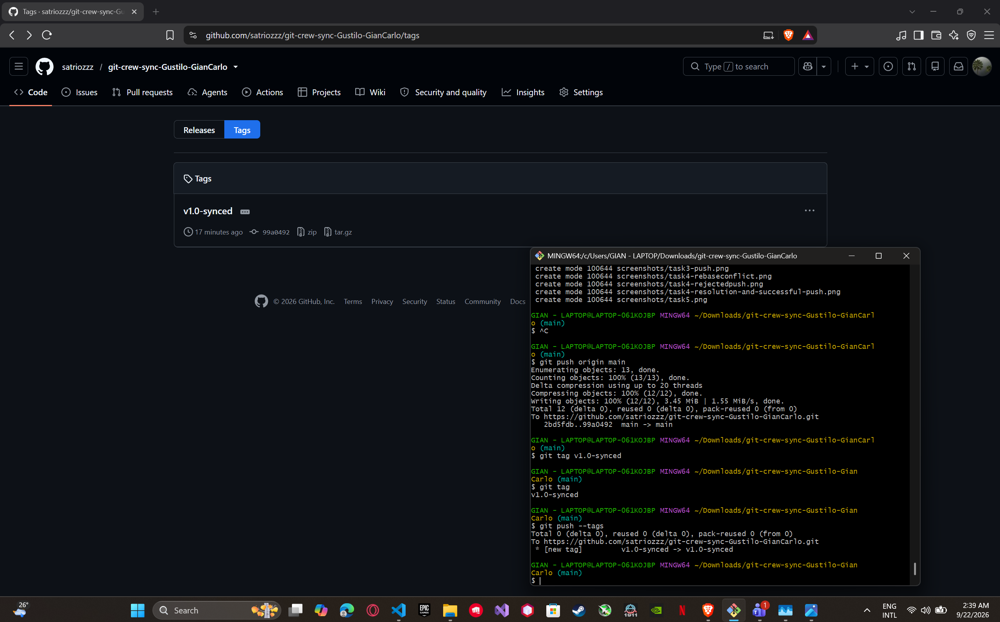

# Crew Sync Workflow

## Task 1 — Push from Clone A

In Clone A, checked out `feature/overtime-pay`, added time-and-a-half overtime pay for shifts over 8 hours, committed the change, and pushed it successfully.

## Task 2 — Diverge from Clone B

In Clone B, changed `calculatePay` to round shift pay instead of truncating it. The push was rejected because Clone B had not fetched Clone A's changes.

## Task 3 — Reconcile with a Merge

Fetched the remote changes in Clone B and merged `feature/overtime-pay`. Resolved the conflict in `calculatePay` so the overtime and rounding behaviors were reconciled. Tests passed and the merged branch was pushed successfully.

## Task 4 — Diverge Again and Rebase

In Clone A, made another change to `calculatePay` without fetching first. The push was rejected. Fetched the remote branch, rebased onto it, resolved the conflict, verified the tests passed, and pushed the rebased branch without using force.

## Task 5 — Merge into Main

Merged the completed `feature/overtime-pay` branch into `main` and pushed `main` successfully.

## Task 6 — Tag and Document

Created the `v1.0-synced` tag and pushed the tag to GitHub. The GitHub repository page shows the `v1.0-synced` tag.

